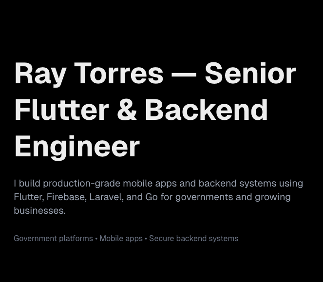
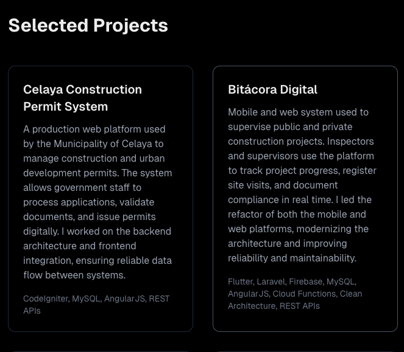

# Ray Torres – Developer Portfolio

Personal portfolio website built with Next.js and Tailwind CSS.

This site showcases selected production projects, including government platforms and mobile applications built with Flutter, Laravel, Go, and Firebase.

## Live Demo
[Demo](https://raytorres.dev)

## Tech Stack

- Next.js (App Router)
- TypeScript
- Tailwind CSS
- pnpm
- Deployed on Vercel

## Getting Started

Clone the repository:

```bash
git clone https://github.com/raytorresch/portfolio.git
cd portfolio
```

Install dependencies:
```bash
pnpm install
```

Run the development server:
```bash
pnpm dev
```

Open [localhost](http://localhost:3000) in your browser.

## Production Build
```bash
pnpm build
pnpm start
```

## Deployment
This project is designed to be deployed on Vercel.

1. Push the repository to GitHub
2. Go to [Vercel](https://vercel.com)
3. Import the repository
4. Use default Next.js settings

## Screenshots



## Author

Ray Torres
Flutter & Backend Engineer

[Email](mailto:ray.torres.dev@gmail.com)

[LinkedIn](https://www.linkedin.com/in/ray-torres-4004b0153/)

[GitHub](https://github.com/raytorresch)

[Portfolio](https://raytorres.dev)

[UpWork](https://www.upwork.com/freelancers/~011d1809efcaa7da80)

## License
This project is under MIT License. See [LICENSE](LICENSE) file for more information.